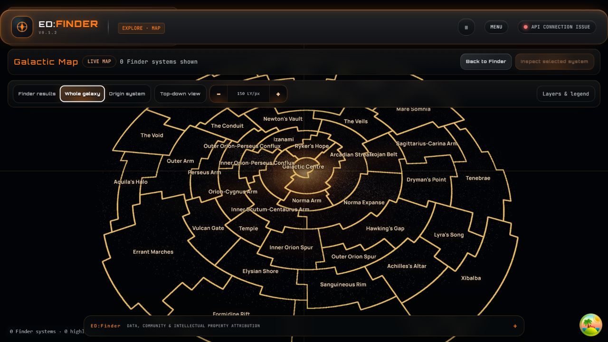
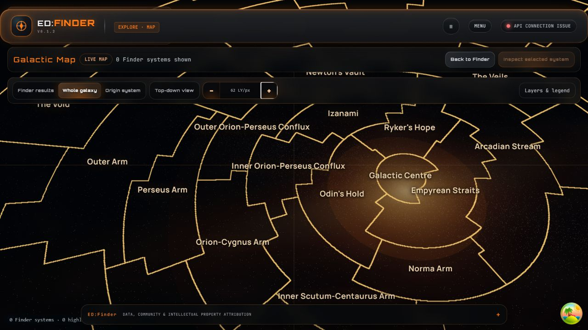
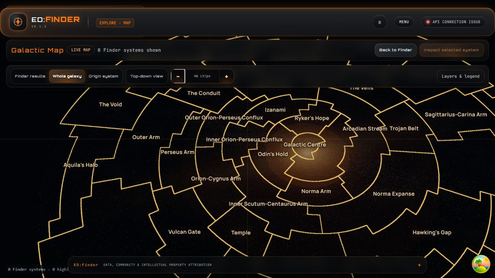
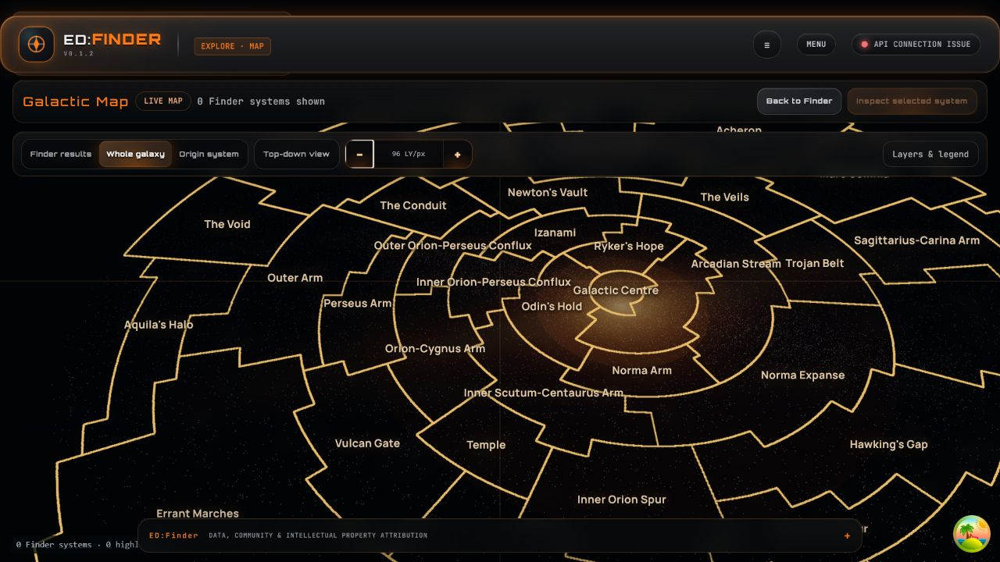

# Task 26F-UX-5 rendered evidence

Observed on the flagged local production-map route with
`VITE_STAGE26E_PRODUCTION_MAP=enabled`.

The glow is a `36,000 LY` world-space plane centred at the real Galactic
Centre coordinate `(25.2, 25,899.9)`. The renderer exposes its projected
screen position and radius as diagnostics; the measurements below were read
from the rendered DOM after real mouse interactions.

| View | Camera centre | Zoom | Pitch | Core screen position | Core radius |
| --- | --- | ---: | ---: | --- | ---: |
| Default whole-galaxy fit | `(-240.81, 25,762.57)` | `149.51 LY/px` | `42 deg` | `(642.27, 363.98)` | `153.33 px` |
| Panned, zoomed in | `(-11,403.60, 28,651.33)` | `62.02 LY/px` | `42 deg` | `(882.74, 415.51)` | `382.31 px` |
| Same pan, zoomed out | `(-11,403.60, 28,651.33)` | `96.29 LY/px` | `42 deg` | `(794.82, 395.40)` | `243.84 px` |
| Same pan and zoom, tilted | `(-11,403.60, 28,651.33)` | `96.29 LY/px` | `52 deg` | `(795.80, 392.22)` | `245.39 px` |

The world coordinate remained exactly `(25.2, 25,899.9)` in every state.
The default whole-galaxy fit intentionally pins the camera because the full
bounded galaxy is visible; the pan evidence therefore zooms inside that fit
before moving the camera.

## Screenshots

### Default reference

### Panned away and zoomed in

### Same pan, zoomed out

### Same pan and zoom, tilted

