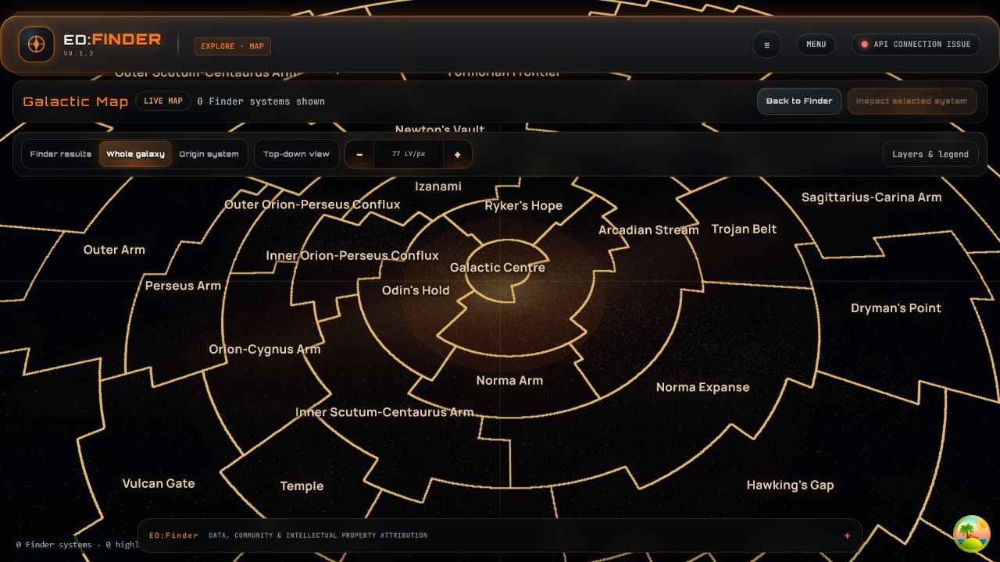
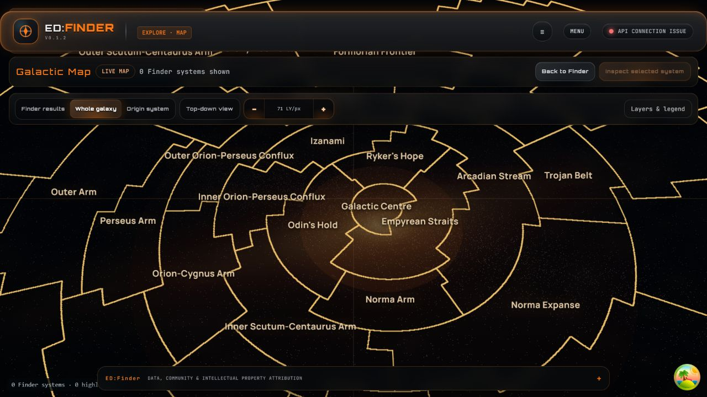
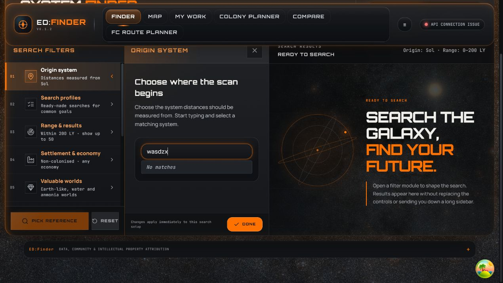

# Task 26F-UX-6 rendered keyboard evidence

Observed on the flagged local production-map route with
`VITE_STAGE26E_PRODUCTION_MAP=enabled`.

The map renderer had focus for every map-key observation. The camera bearing
remained north-locked at zero.

## WASD pan

At `77.2761 LY/px`, each key moved one 32-pixel keyboard step:

| Key | Observed camera delta |
| --- | --- |
| W | `z +2,472.836 LY` |
| A | `x -2,472.836 LY` |
| S | `z -2,472.836 LY` |
| D | `x +2,472.836 LY` |

The paired screenshots show the view before keyboard input and after W then A.
The camera moved from `(-240.807, 25,762.566)` to
`(-2,713.643, 28,235.402)`.

## Z/X smooth zoom

Both keys used the existing eased zoom path. Values read from the rendered
camera during the transition were:

| Key | Start | Mid-animation | Settled |
| --- | ---: | ---: | ---: |
| Z (zoom in) | `71.3349` | `66.8389` | `65.3779 LY/px` |
| X (zoom out) | `65.3779` | `69.2353` | `70.8231 LY/px` |

The focused-component regression test holds Z without issuing key-up, advances
two frames, and observes three continuing zoom intents:
`-80`, `-60`, `-60`. X emits the corresponding positive zoom-out intent.

## Text-field isolation

After leaving the map for Finder, the unrelated Origin system text box accepted
the literal string `wasdzx` and retained focus. No global map listener exists.

